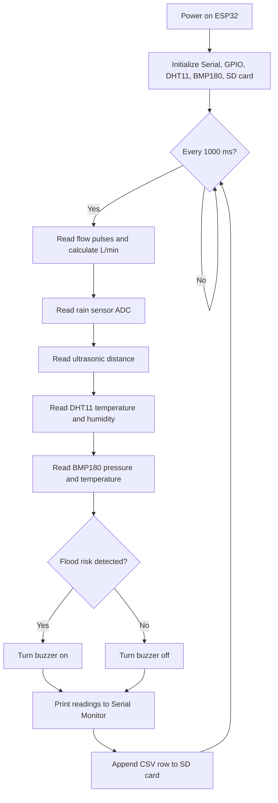

# Firmware Flowchart

```mermaid
flowchart TD
    A["Power on ESP32"] --> B["Initialize Serial, GPIO, DHT11, BMP180, SD card"]
    B --> C{"Every 1000 ms?"}
    C -- "No" --> C
    C -- "Yes" --> D["Read flow pulses and calculate L/min"]
    D --> E["Read rain sensor ADC"]
    E --> F["Read ultrasonic distance"]
    F --> G["Read DHT11 temperature and humidity"]
    G --> H["Read BMP180 pressure and temperature"]
    H --> I{"Flood risk detected?"}
    I -- "Yes" --> J["Turn buzzer on"]
    I -- "No" --> K["Turn buzzer off"]
    J --> L["Print readings to Serial Monitor"]
    K --> L
    L --> M["Append CSV row to SD card"]
    M --> C
```

